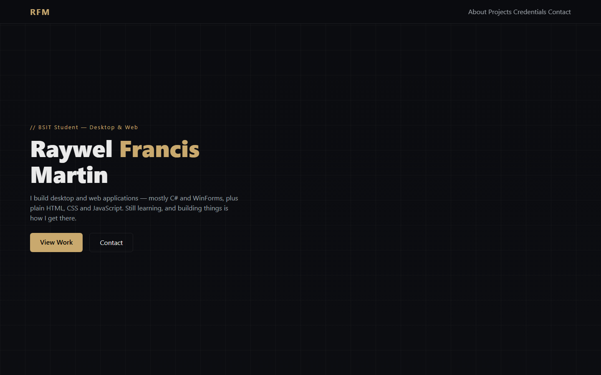
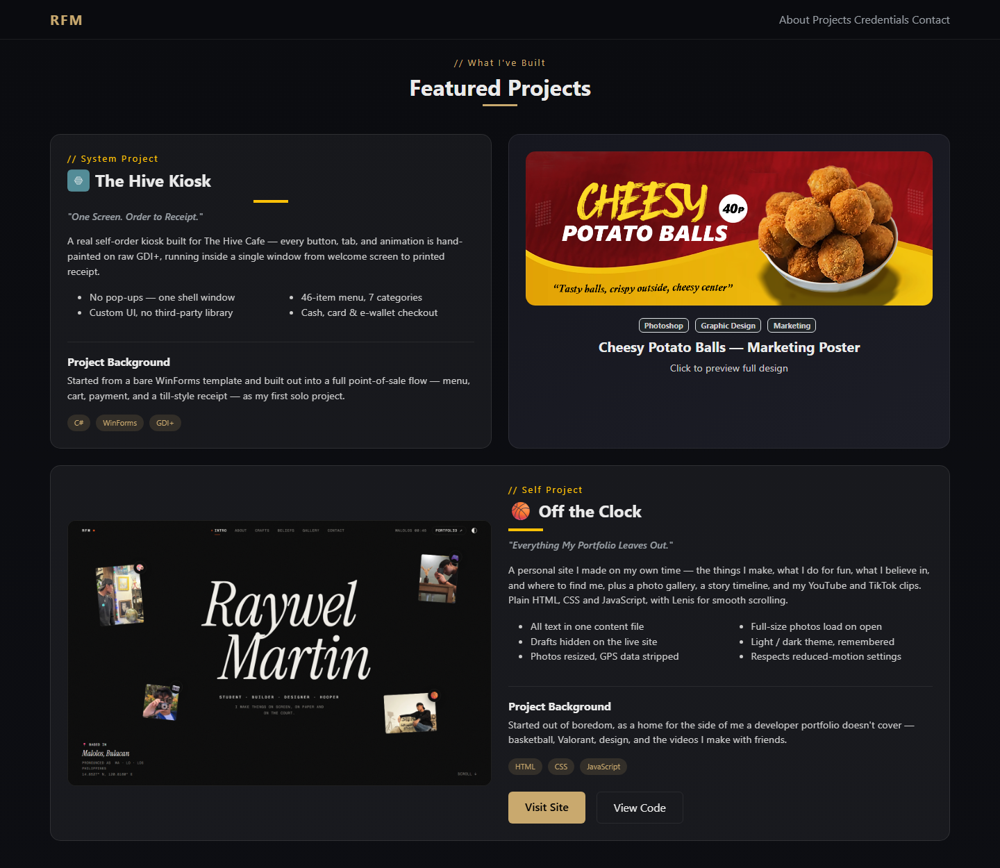
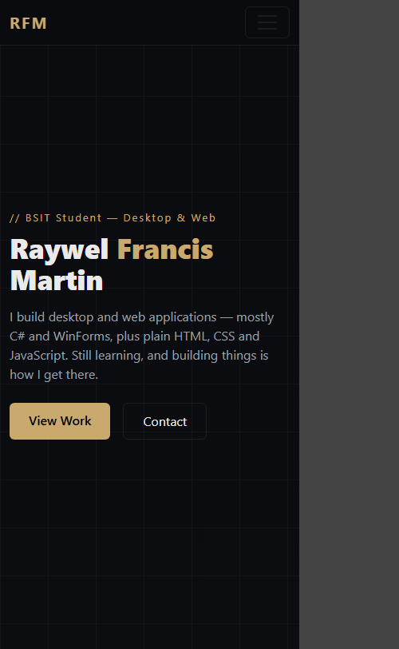

# Release history

Each version is also a git tag, so `git checkout v1.0` shows the site exactly as it was.

| Version | Released | Summary |
|---|---|---|
| [v2.1.1](v2.1.1.md) | October 5, 2026 | Full name in the menu bar |
| [v2.1](v2.1.md) | October 5, 2026 | The contact form sends messages directly through Formspree |
| [v2.0](v2.0.md) | October 5, 2026 | Glass redesign: light and dark themes, case studies, two new projects, no Bootstrap |
| [v1.0](#v10) | March 25 to September 20, 2026 | The first portfolio: Bootstrap, dark theme with a gold accent |

## v1.0

**Tag:** `v1.0` (commit `91bd1b8`), 32 commits from March 25 to September 20, 2026.

A single page built with HTML, CSS and Bootstrap, dark with a gold accent. It had a hero,
an About section with a two-tier tech stack, Featured Projects (The Hive Kiosk, the Cheesy
Potato Balls poster, and Off the Clock), Certifications, Affiliations, a GitHub section and Contact.

