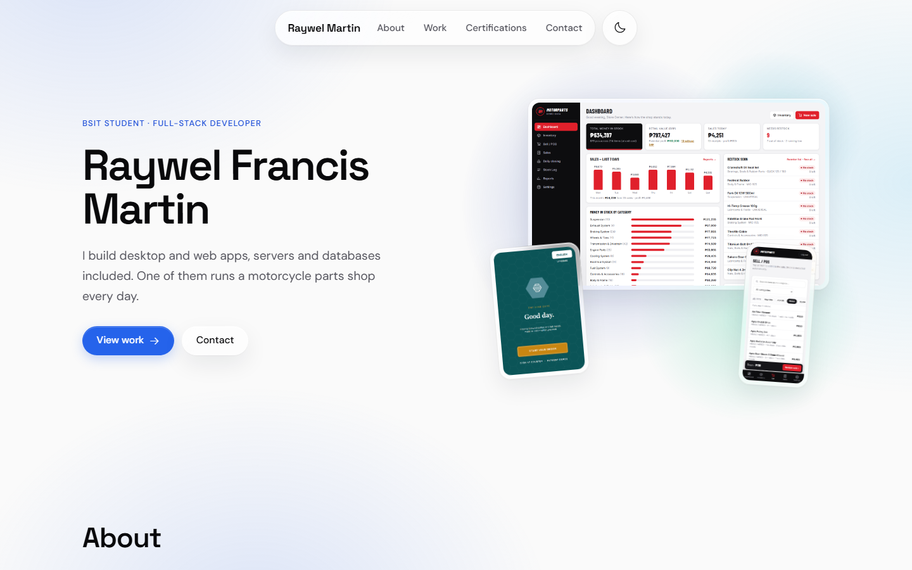
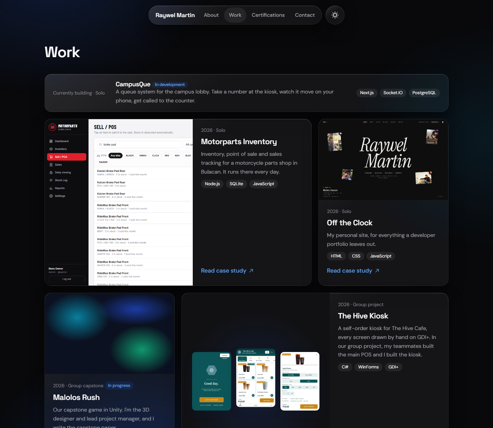
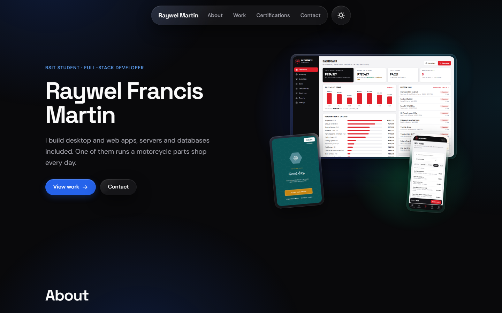
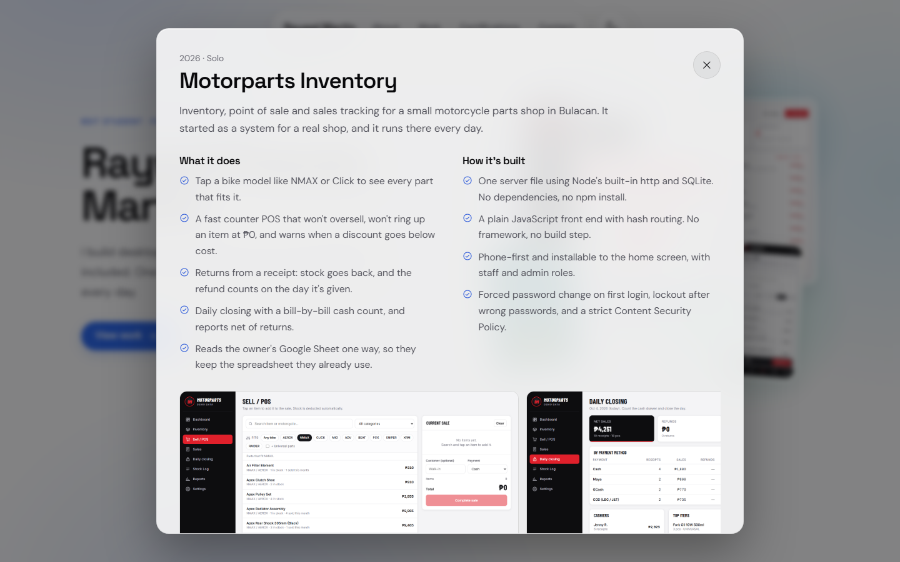
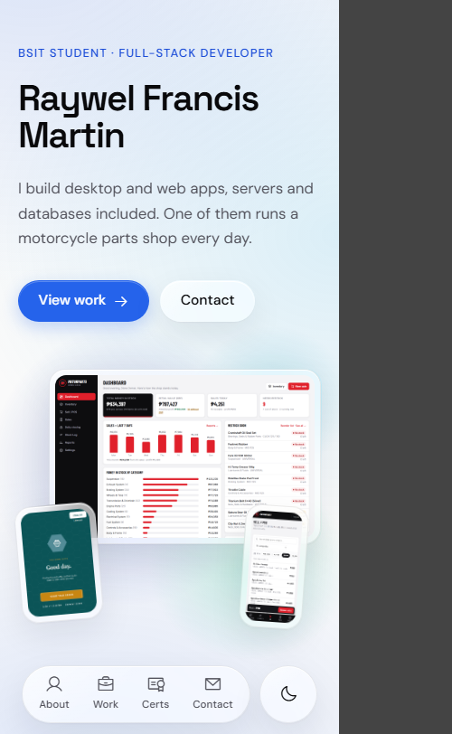
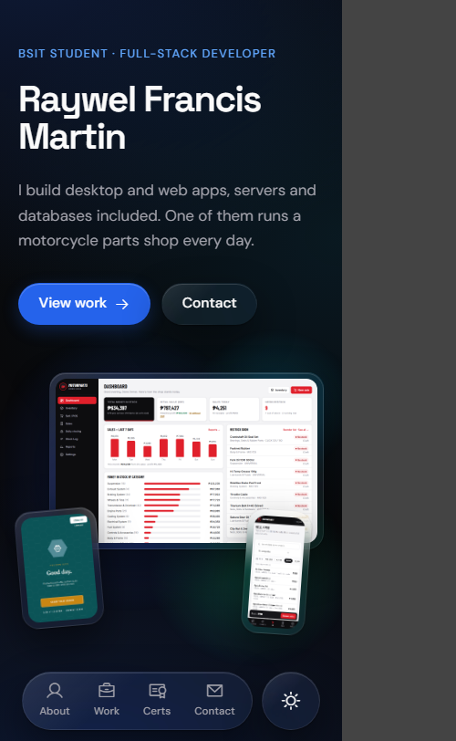

# v2.0: Glass redesign

**Released:** October 5, 2026
**Previous version:** [v1.0](README.md#v10) (March 25 to September 20, 2026)

A full redesign. Same address, same content at its core, new look and new structure.
The idea behind it: stoic by default, expressive when it counts. The everyday interface
stays quiet and quick, and a few chosen moments are allowed to show off.

## Before and after

| v1.0 | v2.0 |
|---|---|
|  |  |
|  |  |

**v2.0 in dark mode, a case study, and on a phone**

| v1.0 on a phone | v2.0 on a phone, light | v2.0 on a phone, dark |
|---|---|---|
|  |  |  |

## New

- **Glass look.** Frosted glass panels with bright edges over soft colour glows. It's a web approximation of Apple's Liquid Glass; the theme switch is a real refracting lens in Chromium browsers.
- **Light and dark themes.** Follows the visitor's system setting, with a switch that remembers their choice.
- **Case studies.** Every project opens a panel with screenshots, what it does, how it's built, and links.
- **Two new projects.** Motorparts Inventory, the system a motorcycle parts shop in Bulacan runs every day, and CampusQue, a campus queue system that's still in development.
- **Phone navigation** moved to a glass bar at the bottom, within thumb reach.
- **Message form** in Contact. It opens the visitor's email app until a Formspree form ID is added.
- **Four expressive moments:** the opening (name assembles, aurora blooms in), an aurora glow that follows the cursor across project cards, a light sweep when the theme changes, and sections rising into place as you scroll.
- **Link preview image** for when the link is shared on LinkedIn, Messenger, Discord or X.
- **A designed 404 page**, with a way back home and a link to my personal site.

## Changed

- **Projects are in date order, newest first,** and each card states who did what. The Hive Kiosk now says it was a group project where my teammates built the main POS and I built the kiosk. Malolos Rush names my roles: 3D designer and lead project manager.
- **The kiosk card no longer claims card and e-wallet checkout.** Those are demo flows; there's no payment processor. Cash orders are real and paid at the counter.
- **The label is now "Full-stack developer",** since Motorparts Inventory has a server, a database and a front end.
- **Tech stack.** Node.js and SQL/SQLite moved to Core. Next.js, Socket.IO and PostgreSQL were added to Familiar with.
- **Typography.** Space Grotesk for headings and DM Sans for everything else, replacing the old system fonts.
- **Copy** tightened in the same humble tone.
- **Logos** are 128px files of 4 to 10 KB instead of 3000px and 4167px originals of 118 KB and 354 KB.

## Removed

- **Bootstrap.** The site is now plain HTML, CSS and JavaScript with no framework.
- **The GitHub section.** The GitHub link moved into Contact.
- **The old look:** the gold accent, the RFM monogram, the "Yao Ming" line and the "//" code-comment labels.

## Kept on purpose

- The address, the page title, and the section anchors, including `#featured`, which my personal site links to.
- The old kiosk screenshots and the Cheesy Potato Balls image, which my personal site loads from here.

## Accessibility

- Text contrast meets WCAG AA in both themes.
- Visible keyboard focus everywhere, plus a skip link.
- Case studies are native dialogs: Escape closes them, and focus goes back to the card that opened them.
- Animation switches off for visitors who ask their system for reduced motion.
- Glass turns solid for visitors who turn transparency off, and in browsers without blur support.
- Form fields have labels above them and errors below them.

## Still to come

- Formspree form ID, so the form sends directly
- GoatCounter visitor stats
- A résumé download
- A professional photo
- Malolos Rush screenshots, once the build is further along
